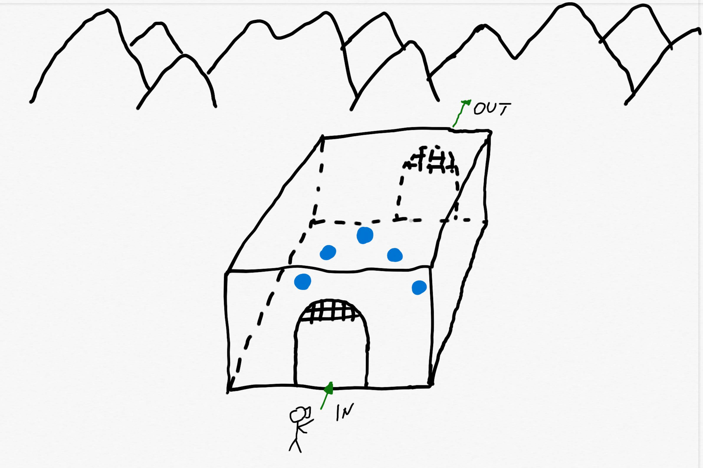

# Michail’s Puzzler Project

As an exercise of an Udacity project, I have created a mobile VR application which is called Puzzler. The creation process included the design of a scene, iteration through the development process and the user testing. At the beginning of the game, the player enters a dungeon in which he has to solve a puzzle involving a similar logic like the 3d game Simon says. To leave the dungeon he has to click the right orbs that are shown by the pattern before.

### Considerations
There were a lot of design concepts to include in this project, but one of the most important was to create an environment in which the user can himself understand the logic of the gameplay by playing it on a mobile phone.

## Puzzler 
The project met a lot of interests who wanted to play the game and feel the mood. This success took place while using an iterative approach to improving the environment, the gameplay and get rid of bugs. The players had never played a VR application even on the mobile phone nor on a PC or a game console but they got very impressed with it.

#### Video

#### Screenshots

## Process 
**Statement of Purpose:** The game Puzzler is a mobile VR application targeting users who want to solve a puzzle game in a new innovative way.

### Persona

*The user persona that was created for this project is called Peter. He is 32 years old works as an Electronics Engineer is married and has two children. Peter likes playing video games and design electronic circuits. He has some experience with VR, cause he has tested some VR games at the informatics fair CEBIT.*

### Sketches
*Underneath I have provided some sketches that were created during the design process to lay out the groundwork of the project.*

## User Testing

### Testing the scene and mood

To test the VR application I conducted a user who had no experience with VR. At first, I tried to find out how big he felt in the environment especially in the dungeon and how the mood was he felt. The user felt his height was appropriate to the environment and felt comfortable in the dungeon with a nice lightening and the objects like the orbs, barrels around him. At the end, I asked him if there is something he cannot see or cannot find in the scene. He had no problem to find anything in the scene.

### Testing the movement and motion sickness    

In this user test, I tried to know how the user felt about the movement speed and if he encountered any motion sickness at all. So at first I asked him to push the button on the HMD and if it moves him into the dungeon. The user mentioned that he got sick cause of the fast movement speed into the dungeon. So I changed the speed to a lower one and asked him to do the test again. After that, he didn’t encounter any sickness anymore. In addition, I asked him if he felt any height changing or disorientation in the movement but he didn’t, too. At the end, I asked him if he encountered any sickness while moving outside of the dungeon but he didn’t notice any problem.

### Testing the whole application from beginning to the end

After he ended playing the application I asked him if there could any improvements and if he felt any sickness. The user didn’t notice any changes that have to make and he didn’t encounter any sickness. The last I wanted to know was what he liked and disliked on the VR application. He was very impressed with the idea to construct such a game and had nothing to criticize.   

### Testing the Start and Restart UI

At the end, I asked him how the UI's were accessible and how he felt the interaction with them. He had nothing to complain about. 

## Breakdown of the Final Design

The steps for the final design included the construction of the Portals at the entrance and exit of the dungeon, adding a skybox which had the mood of the dungeon at night in the desert. These visual effects are shown above in the Puzzler section.

## Conclusion

This game was a nice experience to bring the VR gaming near to users who had no such experience before. The whole process made me a lot of fun from the designing process till to the implementation of code that took place for the behavior. I hope that this kind of application has inspired the users to test more VR apps in future and to test more of my future games of this kind.

## Next steps

Some of the next steps could be creating more levels with a different kind of puzzles.
